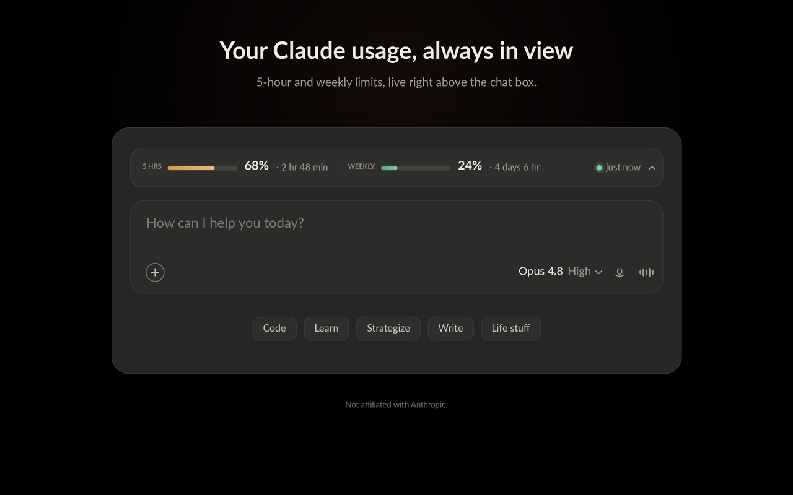
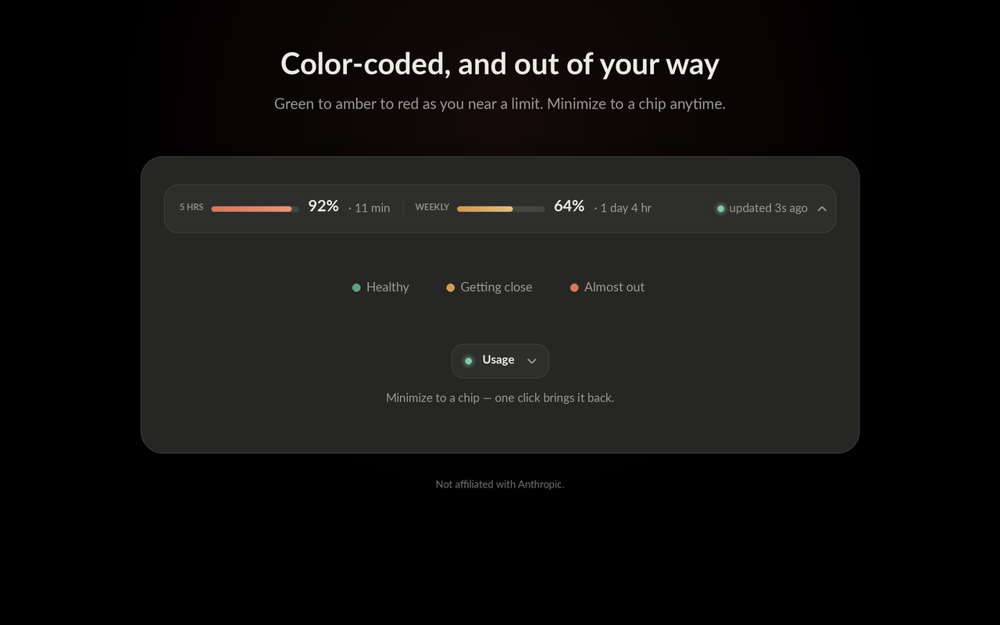
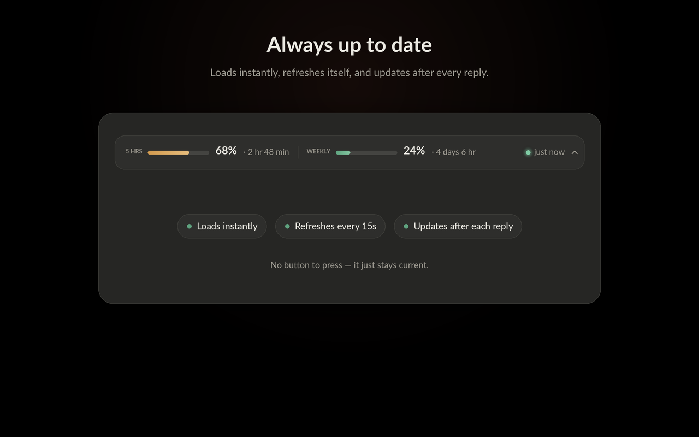
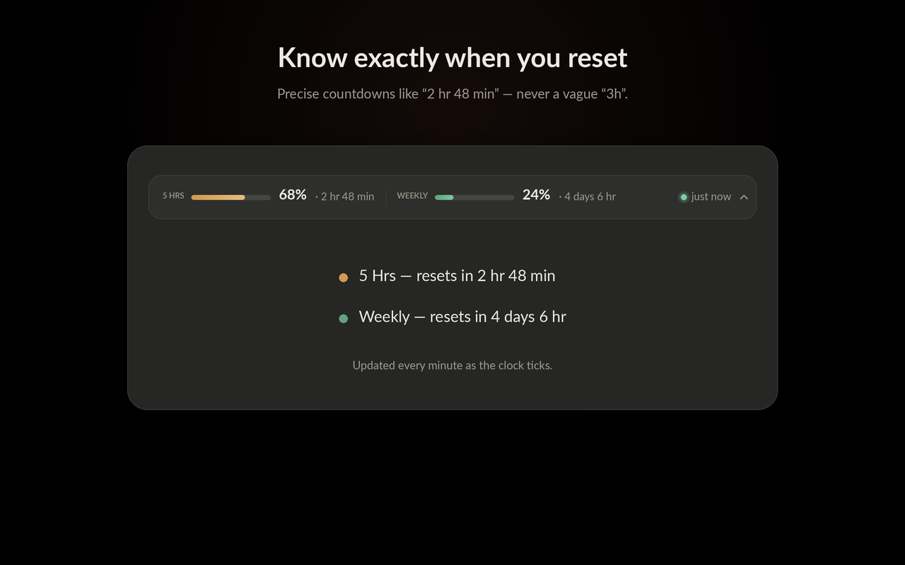
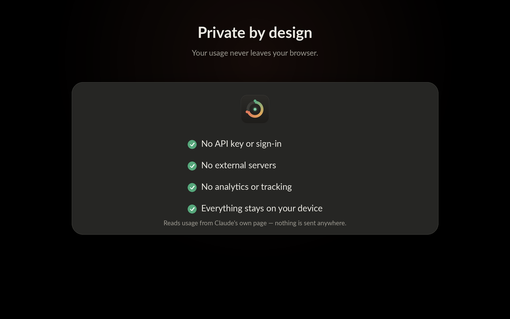

# Usage Meter for Claude

See your Claude **5-hour** and **weekly** usage live, right above the chat box on
claude.ai — no more digging through Settings.



A small, glassy bar sits above the composer showing two readings — **5 Hrs**
(your 5-hour session) and **Weekly** — each with a percentage, a color-coded bar
(green → amber → red), and the exact time until reset (e.g. "2 hr 48 min"). It
loads instantly, refreshes automatically, and keeps everything in your browser.

## Features

- **Always visible** — stop opening Settings → Usage every few minutes
- **Live** — refreshes automatically while the tab is open, and right after each reply
- **Instant** — appears the moment claude.ai loads (cached between visits)
- **Precise resets** — "2 hr 48 min", not a vague "3h"
- **Tidy** — minimize to a small chip, or hide entirely
- **Private** — no API key, no servers, no tracking; data stays on your device

## Screenshots

| | |
|---|---|
|  |  |
|  |  |

## Install

### From the Chrome Web Store
_Coming soon (pending review)._ <!-- Replace with your Chrome Web Store link once live -->

### From source (load unpacked)
1. Download this repo (Code → Download ZIP) or clone it.
2. Open `chrome://extensions`.
3. Enable **Developer mode** (top-right).
4. Click **Load unpacked** and select this folder.
5. Open or reload **https://claude.ai** — the bar appears above the composer.

## How it works

The extension calls claude.ai's own usage API using your existing signed-in
session:

- `GET /api/organizations` → your organization id
- `GET /api/organizations/{id}/usage` → `five_hour` and `seven_day` utilization + reset times

`src/content.js` fetches on load, re-polls every 15s while the tab is visible,
refreshes after each reply, caches the latest values, and renders the bar above
the composer. No build step, no dependencies.

## Privacy

Everything stays in your browser — no external servers, no analytics, no
tracking. See [PRIVACY.md](PRIVACY.md).

## Limitations

- Works on **claude.ai in the browser** (not the Claude desktop app).
- Uses an **unofficial** internal endpoint; if Anthropic changes it, a small
  update to the field names in `src/content.js` may be needed.

## Project structure

```
manifest.json          # MV3 manifest
popup.html / popup.js   # toolbar popup (refresh, interval, hide)
src/content.js          # fetch usage API + render the bar
src/content.css         # bar styles
icons/                  # 16/32/48/128 px
docs/                   # screenshots & promo art
```

## License

[MIT](LICENSE)

---

Not affiliated with, or endorsed by, Anthropic. "Claude" is a trademark of Anthropic.
